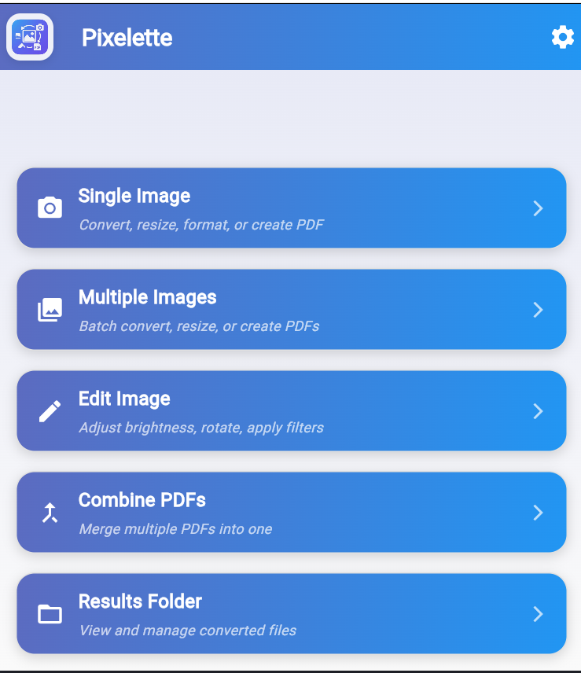
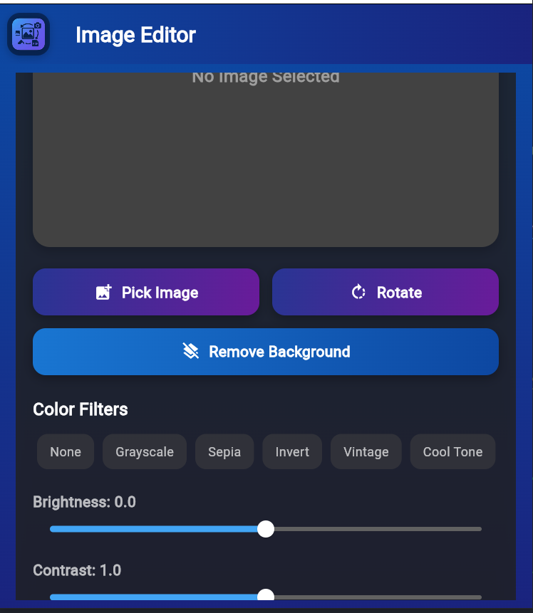
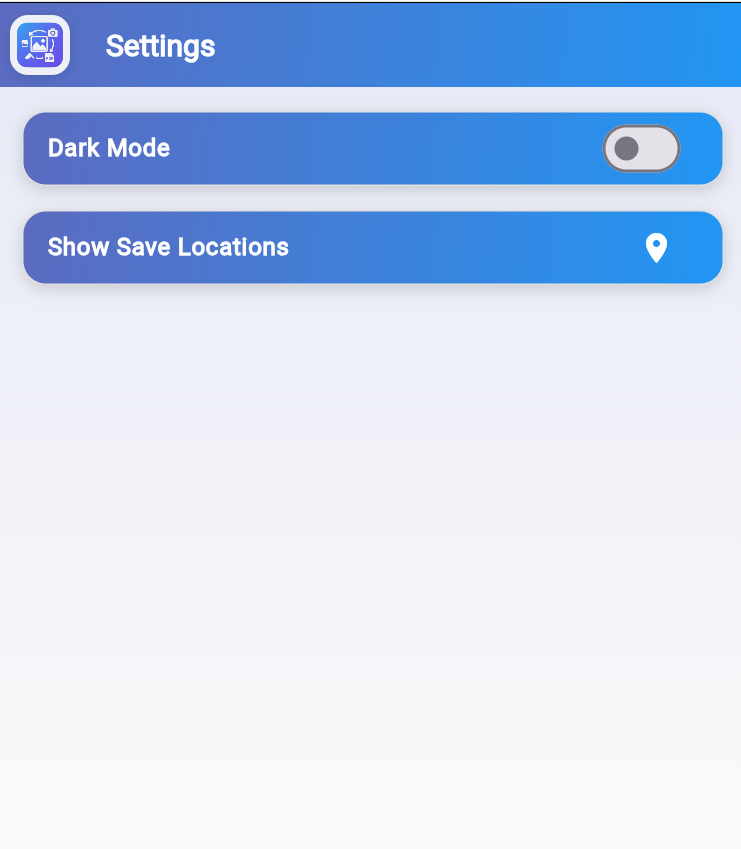
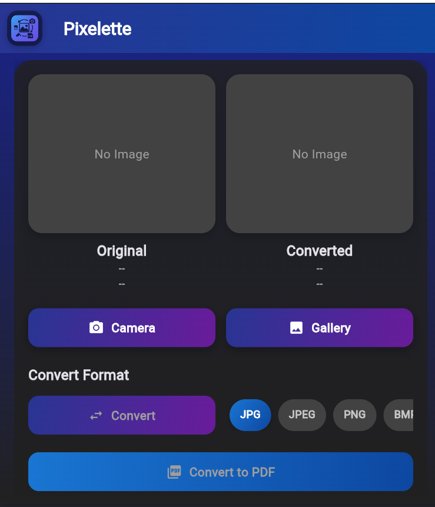
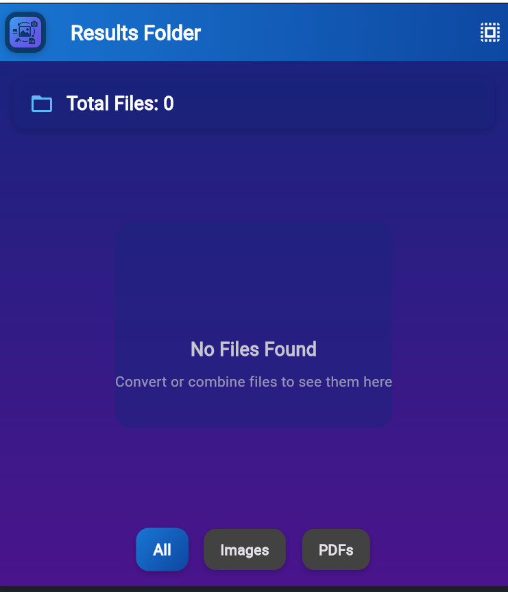

**Image Converter**
Image Converter is a Flutter application that allows users to pick, edit, and convert images, as well as combine images into PDFs. The app supports various image editing features and PDF generation, making it a versatile tool for managing and converting images on mobile devices.
## Screenshots

### Home Screen

### Image Editor Screen

### Settings Screen

### Single Image Screen

### Converted Files Screen

**Features**
Pick images from device storage or camera
Edit images (crop, rotate, etc.)
Combine multiple images into a single PDF
Save and share converted files
Supports popular image and PDF formats
Dependencies
image_picker
path_provider
permission_handler
pdf
printing
image
open_file
intl
shared_preferences
file_picker
media_scanner
image_editor
image_cropper
http
syncfusion_flutter_pdf
cupertino_icons
unity_ads_plugin

**Getting Started**
Clone the repository.
Run flutter pub get to install dependencies.
Use flutter run to launch the app on your device or emulator.
